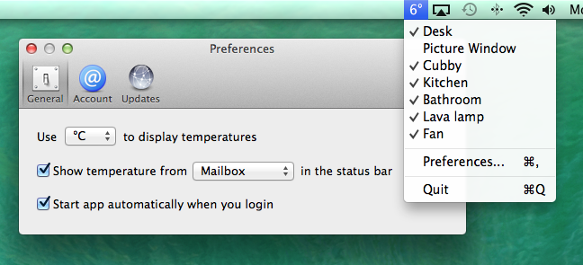

StatusThing
===========

Mac app status bar app for SmartThings

## Download
You can [download the app here](http://alexking.io/StatusThing/StatusThing.zip) (tested on OSX 10.9 only). It's just version 0.1, so please post any issues you encounter!

## Installation Instructions 

Currently there is no way to publish a SmartApp for everyone to use, so you have to create an app with the code yourself before using the mac app. The code for the SmartApp is located at [app.groovy](app.groovy).

1. Login to the [SmartThings Developer IDE](https://graph.api.smartthings.com)
2. Create a new SmartApp – fill in the required fields, and then click `Enable OAuth in Smart App` - this will provide you with a pair of OAuth Client keys. Start up the StatusThing app and copy these keys into the preferences section. 
3. Click the `Create` button in the SmartThings IDE, which will bring up code. Copy the contents of [app.groovy](app.groovy) and paste it into the IDE, then click `Save`, and `Publish` &rarr; `For Me` (important step). 
4. Go back to preferences and click the `Authorize` button under accounts. You'll be redirected to a page where you can set which devices the app can access.
5. Enjoy!

## Build Instructions 
If you're building the app from source, be sure to install [CocoaPods](http://cocoapods.org) and run `pod` in the root directory to include all dependencies.  

## Notes
The app uses the AKSmartThings library, which you can get [here to use in your own projects](https://github.com/alexking/AKSmartThings). 